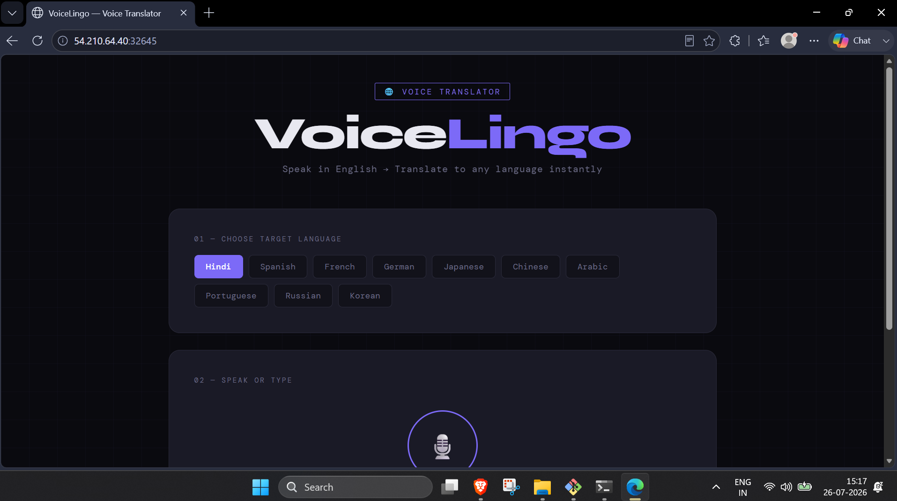
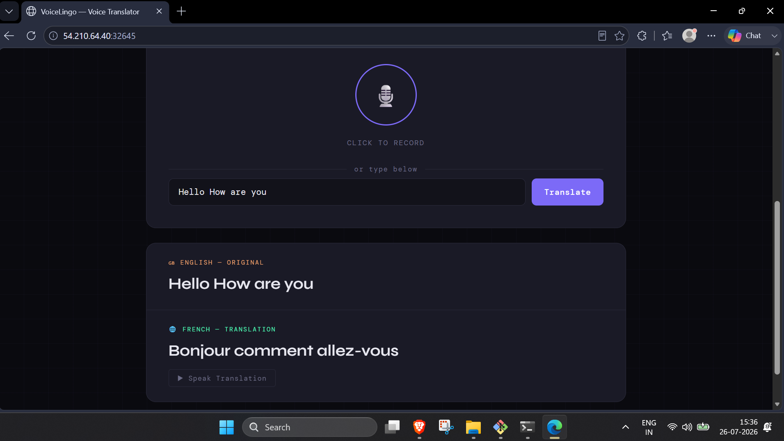
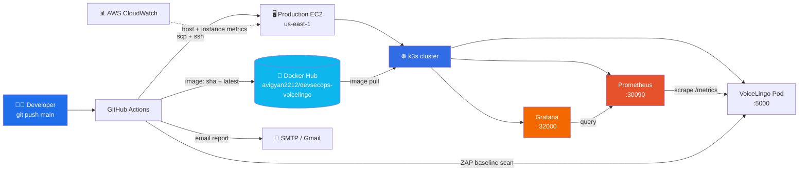
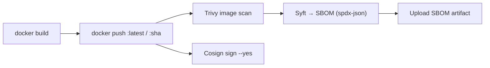
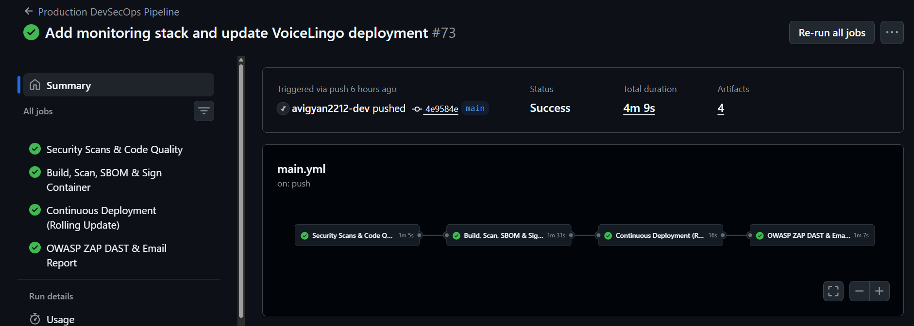
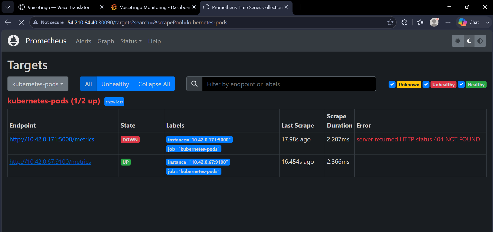
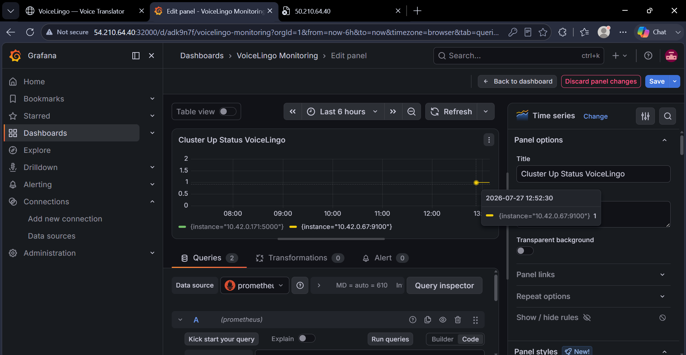
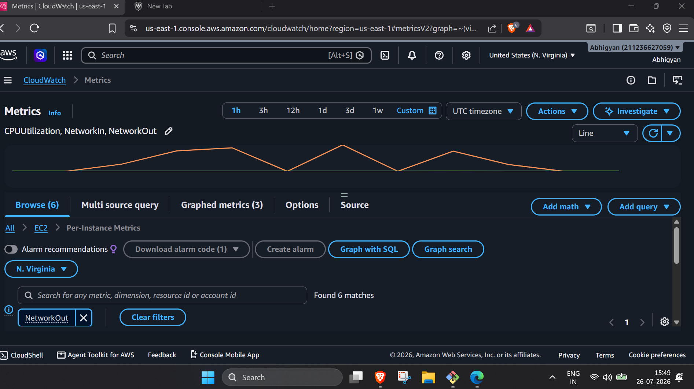
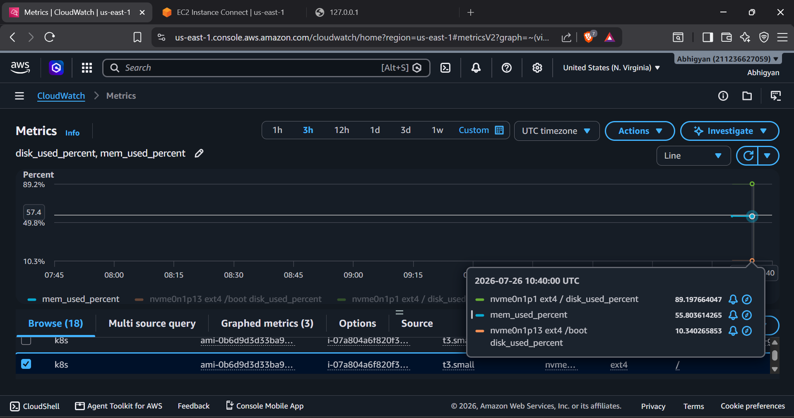

<div align="center">

# 🛡️ VoiceLingo DevSecOps Pipeline

### An end-to-end, production-grade DevSecOps pipeline that scans, builds, signs, deploys, and monitors a real Flask voice-translation app — fully automated

[](.github/workflows/main.yml)
[](Dockerfile)
[-326CE5?logo=kubernetes&logoColor=white)](kubernetes)
[](#-security--quality-gates)
[](#-build-scan-sign--sbom)
[](#-build-scan-sign--sbom)
[](#-observability-stack)

</div>

---

## 🔭 Pipeline at a Glance

Every push to `main` triggers a single workflow (`main.yml`) that runs **four sequential jobs** — shift-left security, supply-chain-secured build, live deployment, and post-deploy DAST — with each job gating the next.

```mermaid
flowchart TD
    A(["🔀 Push to main"]) --> B

    subgraph J1["1️⃣ Security Scans & Code Quality"]
        direction TB
        B1["Checkout code"] --> B2["🔑 Gitleaks — secret scanning"]
        B2 --> B3["🧪 Semgrep — SAST"]
        B3 --> B4["📊 SonarCloud — code quality"]
        B4 --> B5["🛡️ Trivy (fs) — dependency CVEs"]
    end

    subgraph J2["2️⃣ Build, Scan, SBOM & Sign Container"]
        direction TB
        C1["Set up Docker Buildx"] --> C2["🔐 Login to Docker Hub"]
        C2 --> C3["🐳 Build & push image\n(:latest + :sha)"]
        C3 --> C4["🛡️ Trivy (image) — CVE scan"]
        C4 --> C5["📦 Syft — generate SBOM\n(spdx-json)"]
        C5 --> C6["⬆️ Upload SBOM artifact"]
        C6 --> C7["✍️ Cosign — sign image"]
    end

    subgraph J3["3️⃣ Continuous Deployment (Rolling Update)"]
        direction TB
        D1["Patch image tag + registry\nin kubernetes/*.yaml"] --> D2["📤 SCP manifests\nto Production EC2"]
        D2 --> D3["🔧 SSH: kubectl apply\non k3s cluster"]
        D3 --> D4["✅ kubectl rollout status\n(zero-downtime check)"]
    end

    subgraph J4["4️⃣ OWASP ZAP DAST & Reporting"]
        direction TB
        E1["🕷️ ZAP Baseline Scan\nagainst live prod URL"] --> E2["📧 Email scan report\nvia Gmail SMTP"]
    end

    B --> J1
    J1 -->|needs| J2
    J2 -->|needs| J3
    J3 -->|needs| J4
    J4 --> F(["📈 Prometheus + Grafana\ncontinuously monitor prod"])

    style A fill:#1f6feb,color:#fff
    style F fill:#2ea043,color:#fff
    style J1 fill:#3d1f1f,stroke:#f85149
    style J2 fill:#1f2d3d,stroke:#58a6ff
    style J3 fill:#1f3d2a,stroke:#3fb950
    style J4 fill:#3d2f1f,stroke:#d29922
```



**Pipeline philosophy:** shift security **left** (scan the code before it's ever built), secure the **supply chain** (SBOM + signed images), verify the **runtime** (DAST against the live app), and keep the whole thing **observable** (Prometheus/Grafana on the cluster).

---

## 📚 Table of Contents

- [Overview](#-overview)
- [Live Application — VoiceLingo](#-live-application--voicelingo)
- [Architecture](#-architecture)
- [Security & Quality Gates](#-security--quality-gates)
- [Build, Scan, Sign & SBOM](#-build-scan-sign--sbom)
- [Continuous Deployment](#-continuous-deployment)
- [DAST & Automated Reporting](#-dast--automated-reporting)
- [Observability Stack](#-observability-stack)
- [Project Structure](#-project-structure)
- [Getting Started Locally](#-getting-started-locally)
- [Setting Up the Pipeline Yourself](#-setting-up-the-pipeline-yourself)
- [Required GitHub Secrets](#-required-github-secrets)
- [Tech Stack](#-tech-stack)
- [Roadmap](#-roadmap)
- [License](#-license)

---

## 🧾 Overview

**VoiceLingo** is a Flask web app that records/types English speech, converts it to text, and translates it into 10 languages in real time. It's intentionally used here as the "product" being shipped through a hardened DevSecOps pipeline, so the interesting part of this repo is really **`.github/workflows/main.yml`**.

On every push to `main`, GitHub Actions:

1. Scans the source for secrets, SAST issues, code smells, and vulnerable dependencies.
2. Builds a Docker image, scans it, generates a signed SBOM, and pushes it to Docker Hub.
3. Deploys it to a **k3s** cluster running on a production EC2 instance via a zero-downtime rolling update.
4. Runs an OWASP ZAP DAST scan against the live endpoint and emails the report.
5. Prometheus + Grafana, already running on the cluster, continue to monitor the deployment's health, CPU, memory, disk, and network in real time.

---

## 🗣️ Live Application — VoiceLingo

| Language selection | Live translation |
|---|---|
|  |  |

The app is served from the `voicelingo-service` NodePort (`:32645`) on the k3s cluster, fronted by the EC2 instance's public IP — the exact target that the pipeline's DAST job scans on every deploy.

---

## 🏗️ Architecture



---

## 🔒 Security & Quality Gates

*Job 1 — `security-scans` (runs on every push, before anything is built)*

| Tool | Purpose | Fails the build on |
|---|---|---|
| **[Gitleaks](https://github.com/gitleaks/gitleaks-action)** | Scans full git history for leaked secrets, API keys, tokens | Any detected secret |
| **[Semgrep](https://github.com/returntocorp/semgrep-action)** (`p/default`) | Static Application Security Testing (SAST) across the codebase | Rule violations per config |
| **[SonarCloud](https://sonarcloud.io/)** | Code quality, maintainability, and security hotspot analysis | Quality gate failure |
| **[Trivy](https://github.com/aquasecurity/trivy-action)** (filesystem mode) | Scans `requirements.txt` / dependencies for known CVEs | Any `CRITICAL` / `HIGH` fixable vulnerability |

> 💡 The `Dockerfile` also proactively pins `wheel>=0.46.2` and upgrades `pip`/`setuptools` at build time to pre-empt CVE-2026-24049 before Trivy even gets to it.

---

## 📦 Build, Scan, Sign & SBOM

*Job 2 — `build-and-sign` (only runs if Job 1 passes)*

1. **Docker Buildx** sets up the builder.
2. Image is **built and pushed** to Docker Hub tagged both `:latest` and `:${{ github.sha }}` — so every deployment is traceable back to an exact commit.
3. **Trivy** scans the *built image itself* (not just the filesystem) for `CRITICAL`/`HIGH` CVEs — a second, independent gate.
4. **[Syft](https://github.com/anchore/sbom-action)** generates a full **SPDX-JSON Software Bill of Materials** and uploads it as a workflow artifact — giving complete supply-chain transparency for every release.
5. **[Cosign](https://github.com/sigstore/cosign-installer)** cryptographically **signs the published image**, so anyone pulling it can verify it hasn't been tampered with post-build.



---

## 🚀 Continuous Deployment

*Job 3 — `deploy-to-production` (rolling update, zero downtime)*

1. `sed` rewrites the Docker Hub username and image tag inside `kubernetes/*.yaml` to point at the **exact commit SHA** that just passed security + build gates — never `:latest` on the cluster.
2. Manifests are **SCP'd** to the production EC2 host.
3. Over **SSH**, the runner exports `KUBECONFIG` for the local **k3s** install and runs:
   ```bash
   kubectl apply -f ~/kubernetes/ --validate=false
   kubectl rollout status deployment/voicelingo-deployment --timeout=120s
   ```
4. The job only succeeds once Kubernetes confirms the rollout is healthy — giving a real go/no-go signal in the Actions UI.


*A real run of the 4-stage pipeline — all four jobs green in ~4 minutes.*

---

## 🕷️ DAST & Automated Reporting

*Job 4 — `owasp-zap-scan` (runs only after a successful deploy)*

- **[OWASP ZAP Baseline Scan](https://github.com/zaproxy/action-baseline)** is pointed directly at the live production URL, testing the *real, just-deployed* app for XSS, misconfigurations, missing security headers, and more — dynamic testing, not static.
- A summary email is automatically sent (via Gmail SMTP) to the security distribution list with a link back to the full ZAP report in the workflow logs — so the loop closes without anyone needing to manually check Actions.

---

## 📊 Observability Stack

Prometheus and Grafana run as first-class workloads on the same k3s cluster (see `kubernetes/prometheus.yaml` and `kubernetes/grafana.yaml`), using RBAC-scoped service discovery to auto-detect any pod annotated with `prometheus.io/scrape: "true"` — including the VoiceLingo deployment itself.

| Prometheus target discovery | Grafana — cluster health |
|---|---|
|  |  |

| CloudWatch — CPU & Network | CloudWatch — Disk & Memory |
|---|---|
|  |  |

- **Prometheus** (`NodePort :30090`) scrapes all annotated pods every 15s via `kubernetes_sd_configs`.
- **Grafana** (`NodePort :32000`) visualizes app up/down status and cluster-wide health from Prometheus as its data source.
- **AWS CloudWatch** provides host-level EC2 metrics (CPU, network, disk, memory) as a second, independent layer of observability outside the cluster.

---

## 📁 Project Structure

```
DevSecOps-main/
├── .github/
│   └── workflows/
│       └── main.yml          # The 4-job CI/CD pipeline
├── kubernetes/
│   ├── deployment.yaml        # VoiceLingo Deployment (annotated for Prometheus)
│   ├── service.yaml           # NodePort service (:32645)
│   ├── prometheus.yaml        # Prometheus RBAC + ConfigMap + Deployment + Service
│   └── grafana.yaml           # Grafana Deployment + Service
├── templates/
│   └── index.html             # VoiceLingo frontend
├── app.py                     # Flask app: speech-to-text + translation API
├── Dockerfile                 # Hardened, CVE-patched container build
├── requirements.txt           # Python dependencies
├── sonar-project.properties   # SonarCloud config
└── README.md
```

---

## 💻 Getting Started Locally

**Prerequisites:** Python 3.11+, `portaudio` (for PyAudio), Docker (optional).

```bash
# 1. Clone the repo
git clone https://github.com/<your-username>/DevSecOps.git
cd DevSecOps

# 2. Create a virtual environment
python3 -m venv venv
source venv/bin/activate      # Windows: venv\Scripts\activate

# 3. Install system dependency for PyAudio (Debian/Ubuntu)
sudo apt-get install -y portaudio19-dev

# 4. Install Python dependencies
pip install -r requirements.txt

# 5. Run the app
python app.py
# → open http://127.0.0.1:5000
```

**Or run it in Docker:**

```bash
docker build -t devsecops-voicelingo .
docker run -p 5000:5000 devsecops-voicelingo
```

---

## ⚙️ Setting Up the Pipeline Yourself

1. **Fork/clone** this repo and push it to your own GitHub account.
2. Create accounts / tokens for: **Docker Hub**, **SonarCloud**, and an SMTP-capable email account (e.g. Gmail App Password).
3. Provision a Linux host (EC2 or any VM) with **k3s** installed, reachable over SSH from GitHub Actions.
4. Add the [required secrets](#-required-github-secrets) below under **Settings → Secrets and variables → Actions**.
5. Update `sonar.organization` / `sonar.projectKey` in the workflow to match your SonarCloud project.
6. Update the ZAP scan `target` URL in `main.yml` to your own deployment's address.
7. Push to `main` — watch all four jobs run in the **Actions** tab.

---

## 🔑 Required GitHub Secrets

| Secret | Used for |
|---|---|
| `DOCKERHUB_USERNAME` / `DOCKERHUB_TOKEN` | Login + push to Docker Hub |
| `SONAR_TOKEN` | SonarCloud analysis |
| `EC2_HOST` | SSH/SCP target for deployment |
| `EC2_SSH_KEY` | Private key for the production host |
| `MAIL_USERNAME` / `MAIL_PASSWORD` | SMTP auth for the DAST report email |
| `MAIL_RECIPIENT` | Where the ZAP report summary is sent |
| `GITHUB_TOKEN` | Provided automatically by Actions (Gitleaks, SonarCloud) |

---

## 🧰 Tech Stack

**App:** Flask · Flask-CORS · SpeechRecognition · googletrans

**CI/CD:** GitHub Actions

**Security:** Gitleaks · Semgrep · SonarCloud · Trivy · OWASP ZAP · Cosign · Syft (SBOM)

**Infra & Runtime:** Docker · Kubernetes (k3s) · AWS EC2

**Observability:** Prometheus · Grafana · AWS CloudWatch

---

## 🗺️ Roadmap

- [ ] Move from NodePort to an Ingress + TLS for the production endpoint
- [ ] Add Alertmanager rules on top of Prometheus for pod-down/high-CPU alerts
- [ ] Promote SBOM to attach as an in-toto/SLSA provenance attestation
- [ ] Add a staging environment + manual approval gate before production deploy

---

## 📄 License

This project is available under the [MIT License](LICENSE).

